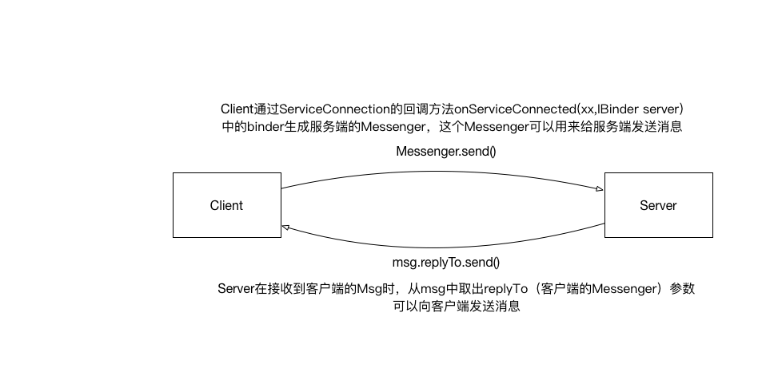

### 基本使用方法
服务端实现
```java
public class MessengerService extends Service {
    public static final int MSG_ADD_STUDENT = 1; //添加学生
    public static final int MSG_GET_STUDENTS = 2; //获取学生
    public static final String INTENT_KEY_STUDENT = "intent_key_student";
    public static final String INTENT_KEY_STUDENTS = "intent_key_students";

    /**
    * 创建一个与Handler绑定的Messenger 
    */
    private final Messenger messenger = new Messenger(new MessengerHandler());


    @Override
    public void onCreate() {
        super.onCreate();
        Log.d(TAG, "MessengerService onCreate");
    }

    @Override
    public int onStartCommand(Intent intent, int flags, int startId) {
        Log.d(TAG, "MessengerService onStartCommand");
        return super.onStartCommand(intent, flags, startId);
    }

    /**
    * 返回Messenger中的IBinder 
    */
    @Nullable
    @Override
    public IBinder onBind(Intent intent) {
        return messenger.getBinder();
    }

    /**
    * 服务端的Handler，里面重写了handlerMessage方法，在里面处理客户端发来的消息
    */
    private static class MessengerHandler extends Handler {
        private ArrayList<Student> students = new ArrayList<>();

        @Override
        public void handleMessage(Message msg) {
            switch (msg.what) {
                case MSG_ADD_STUDENT:
                    Log.d(TAG, "service add student");
                    /**
                    * 这里不设置classLoader就会classNotFound 
                    */
                    msg.getData().setClassLoader(Student.class.getClassLoader());
                    Student student = msg.getData().getParcelable(INTENT_KEY_STUDENT);
                    students.add(student);

                    break;
                case MSG_GET_STUDENTS:
                    try {
                        Message message = Message.obtain(null, MSG_GET_STUDENTS);
                        Bundle bundle = new Bundle();
                        bundle.putParcelableArrayList(INTENT_KEY_STUDENTS, students);
                        message.setData(bundle);
                        Log.d(TAG, "messenger thread" + Thread.currentThread().getName());
                        /**
                        * 这里休眠3s,模拟耗时操作，测试服务端的阻塞不会导致客户端阻塞 
                        */
                        try {
                            Thread.sleep(3000);
                        } catch (InterruptedException e) {
                            e.printStackTrace();
                        }
                        /**
                        *这里将服务端的消息发回给客户端，replyTo是从客户端传过来的Messenger
                        */
                        msg.replyTo.send(message);
                    } catch (RemoteException e) {
                        e.printStackTrace();
                    }
                default:
                    super.handleMessage(msg);
                    break;
            }
        }
    }
}
```
客户端代码
```java
public class MainActivity extends AppCompatActivity {
    /**
    * 服务端的Messenger，从ServiceConnection的onServiceConnected()方法中赋值
    */
    private Messenger serviceMessenger;
    
    /**
    * 客户端的Handler，要处理服务端发送回来的消息 
    */
    private Handler clientMessengerHandler = new Handler() {
           @Override
           public void handleMessage(Message msg) {
               switch (msg.what) {
                   case MSG_GET_STUDENTS:
                       /**
                       * 这里不设置classLoader就会classNotFound 
                       */
                       msg.getData().setClassLoader(Student.class.getClassLoader());
                       ArrayList<Student> students = msg.getData().getParcelableArrayList(INTENT_KEY_STUDENTS);
                       assert students != null;
                       Log.d(AIDLService.TAG, students.toString());
                       break;
                   default:
                       super.handleMessage(msg);
               }
           }
       };
    /**
    * 客户端的Messenger,当发送给服务端message时并且需要服务器回应客户端，此时将这个Messenger设置为message的replyTo 
    */
    private Messenger clientMessenger = new Messenger(clientMessengerHandler);
    
    private ServiceConnection messengerConnection = new ServiceConnection() {
        @Override
        public void onServiceConnected(ComponentName name, IBinder service) {
            /**
            * 调用Messenger的构造函数
            */
            serviceMessenger = new Messenger(service);
        }
    
        @Override
        public void onServiceDisconnected(ComponentName name) {
    
        }
    };
    private void message(){
        btnMessengerAddStudent.setOnClickListener(new View.OnClickListener() {
                    @Override
                    public void onClick(View v) {
                        Message message = Message.obtain(null, MessengerService.MSG_ADD_STUDENT);
                        Bundle bundle = new Bundle();
                        bundle.putParcelable(MessengerService.INTENT_KEY_STUDENT, new Student("huangchen", 1));
                        message.setData(bundle);
                        message.replyTo = clientMessenger;
                        try {
                            serviceMessenger.send(message);
                        } catch (RemoteException e) {
                            e.printStackTrace();
                        }
                    }
                });
        
                btnMessengerGetAllStudent.setOnClickListener(new View.OnClickListener() {
                    @Override
                    public void onClick(View v) {
                        Message message = Message.obtain(null, MSG_GET_STUDENTS);
                        /**
                        * 需要服务端给客户端回消息，需要将客户端的Messenger放在Message中传递给服务端 
                        */
                        message.replyTo = clientMessenger;
                        try {
                            serviceMessenger.send(message);
                        } catch (RemoteException e) {
                            e.printStackTrace();
                        }
                        Log.d(BookProvider.TAG, "Messenger send for reply");
                    }
                });
    }
}
```
### 原理

### 源码解析
#### 服务端
首先服务端调用的相关代码
```java
    @Nullable
    @Override
    public IBinder onBind(Intent intent) {
        return messenger.getBinder();
    }
```
调用了Messenger的getBinder()方法,看一下getBinder():
```java
    /**
     * Retrieve the IBinder that this Messenger is using to communicate with
     * its associated Handler.
     * 
     * @return Returns the IBinder backing this Messenger.
     */
    public IBinder getBinder() {
        return mTarget.asBinder();
    }
```
调用了mTarget的asBinder方法，在看一下mTarget在服务端的赋值：
```java
    /**
     * Create a new Messenger pointing to the given Handler.  Any Message
     * objects sent through this Messenger will appear in the Handler as if
     * {@link Handler#sendMessage(Message) Handler.sendMessage(Message)} had
     * been called directly.
     * 
     * @param target The Handler that will receive sent messages.
     */
    public Messenger(Handler target) {
        mTarget = target.getIMessenger();
    }
```
直接调用了Handler的getIMessenger()方法。再看Handler中的相关方法：
```java
    final IMessenger getIMessenger() {
        synchronized (mQueue) {
            if (mMessenger != null) {
                return mMessenger;
            }
            mMessenger = new MessengerImpl();
            return mMessenger;
        }
    }

    private final class MessengerImpl extends IMessenger.Stub {
        public void send(Message msg) {
            /**
            * sendingUid用来区分是哪个进程的客户端发送的Message
            */
            msg.sendingUid = Binder.getCallingUid();
            /**
            * 实际是是调用跟它绑定的Handler发送Message 
            */
            Handler.this.sendMessage(msg);
        }
    }
```
在熟悉不过的代码了，在Handler中有一个MessengerImpl，它继承了IMessenger.Stub类，根据AIDL的知识我们知道，MessengerImpl的asBinder()方法是返回this即它自己。
上面的getIMessenger()方法是一个线程同步的方法，mMessenger是一个单例。这样做可以多个客户端同时bind的时候Service只生成一个mMessenger。

#### 客户端
```java
private ServiceConnection messengerConnection = new ServiceConnection() {
        @Override
        public void onServiceConnected(ComponentName name, IBinder service) {
            /**
            * 调用Messenger的另一个构造方法 
            */
            serviceMessenger = new Messenger(service);
        }

        @Override
        public void onServiceDisconnected(ComponentName name) {

        }
    };
```
这里调用Messenger的另一个构造方法
```java
    public Messenger(IBinder target) {
        mTarget = IMessenger.Stub.asInterface(target);
    }
```
用的是AIDL的方法，将服务端返回给客户端的IBinder转成一个Messenger，客户端可以使用这个Messenger给服务端发送消息

#### 服务端与客户端通信
在前面基本使用方法中提到了message.replyTo，将客户端的Messenger赋值给发送给服务器的Message的replyTo参数上，服务端在处理该Message的时候就可以取到客户端的Messenger，进而可以给客户端发送消息了。
Message除了能传递基本类型之外，还能传递序列化的对象。显然Messenger是实现了Parcelable接口的。
```java
    public static void writeMessengerOrNullToParcel(Messenger messenger,
            Parcel out) {
        out.writeStrongBinder(messenger != null ? messenger.mTarget.asBinder()
                : null);
    }
    public static Messenger readMessengerOrNullFromParcel(Parcel in) {
            IBinder b = in.readStrongBinder();
            return b != null ? new Messenger(b) : null;
    }
```
上面Messenger源码中的两个方法可以看出，将客户端的binder传递给了服务端，但是暴露给用户的却是将客户端的messenger传递给服务端，这里对用户隐藏了实现细节。

还有一点非常重要的是Handler处理消息是串行的，不能并发，所以采用Messenger通信是线程安全的。

Messenger和AIDL还有一个很大的区别，AIDL调用服务端的方法时会阻塞客户端等待服务器的返回，但是Messenger不会。[http://blog.csdn.net/lmj623565791/article/details/47017485](http://blog.csdn.net/lmj623565791/article/details/47017485) 文章中有所解释
### 参考文章
* [http://blog.csdn.net/yanbober/article/details/48373341](http://blog.csdn.net/yanbober/article/details/48373341)
* [https://www.diycode.cc/topics/361](https://www.diycode.cc/topics/361)
* [http://blog.csdn.net/lmj623565791/article/details/47017485](http://blog.csdn.net/lmj623565791/article/details/47017485)